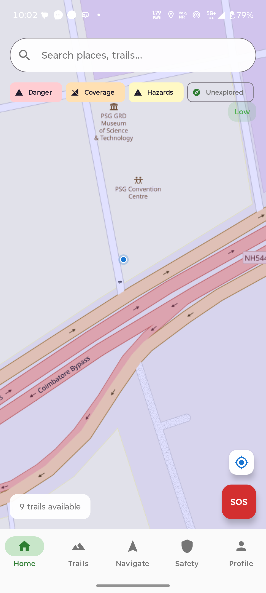
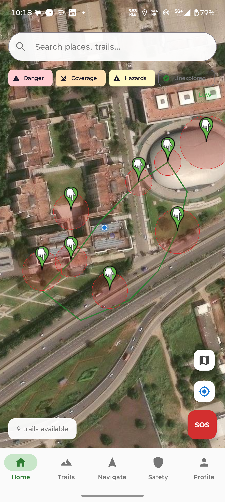
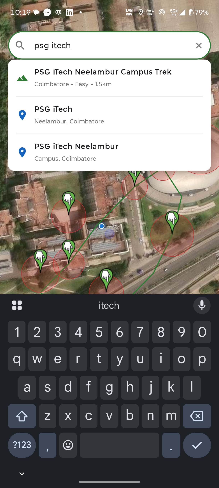
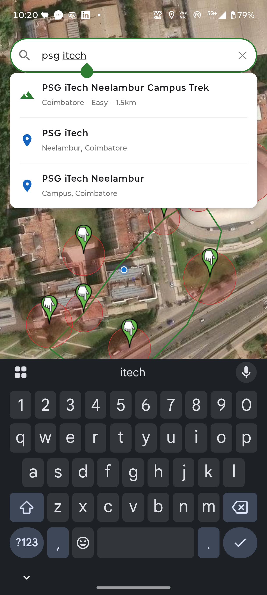
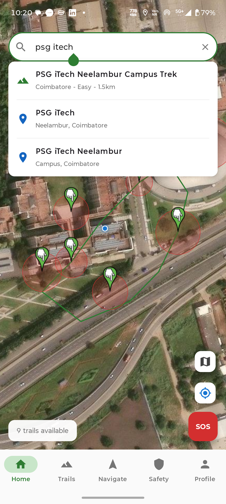
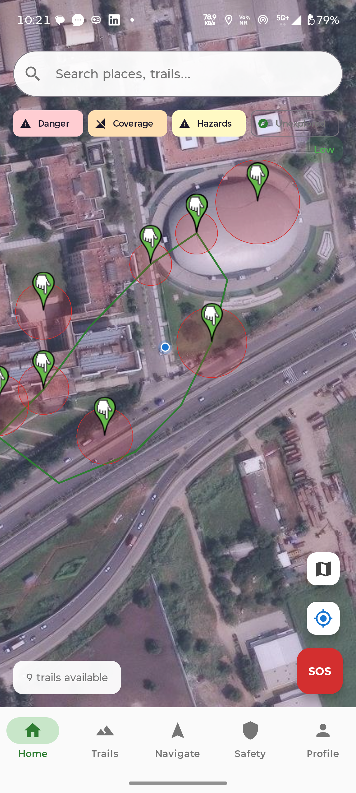
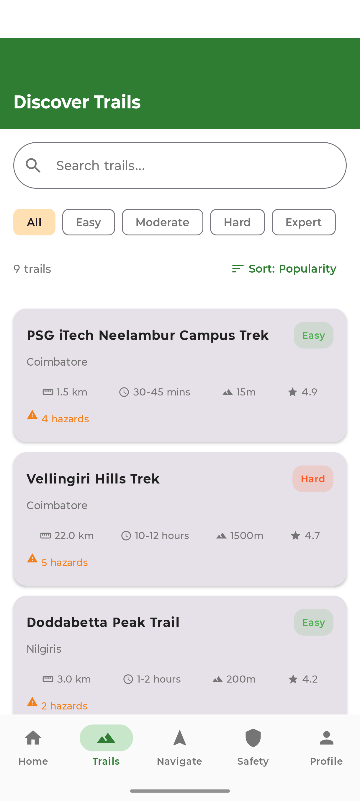

# Hiking Trail Navigator

**Integrated Trail Discovery and Safety Platform**

A native Android application built with Kotlin and Jetpack Compose that provides comprehensive hiking trail navigation, real-time safety monitoring, SOS emergency alerts, fall detection, and an admin system for forest officers.

## Authors

- **Tarunswamy M** - Development & Architecture
- **Poornesh P** - Initial Code & Requirements

**PSG Institute of Technology, Coimbatore** | OOSE Lab - January 2026

## Features

### Trail Discovery & Navigation (FR-101, FR-102)
- 9 real hiking trails around Coimbatore / Western Ghats + 1 PSG iTech campus demo trail
- Satellite map view with ESRI World Imagery tiles (osmdroid)
- **Directions mode**: View trail route with green safe path, danger zones, start/end markers
- **Start Hike mode**: GPS-following live tracking with real-time stats, walked path in orange
- **Turn-by-turn guidance**: Compass bearing + distance to next waypoint
- Trail search with location suggestions, difficulty filtering, sorting

### Safety System (FR-201 - FR-209)
- **SOS Emergency** (FR-202): One-tap SOS sends SMS to contacts + Forest Dept (1800-425-1600) + SDMA (1070) - works offline
- **Silent SOS** (FR-207): Discreet emergency alert without vibration, also via 5 rapid volume-down presses
- **Fall Detection** (FR-203): 3-phase algorithm (accelerometer + gyroscope): Freefall -> Impact -> Rotation within time window
- **Safety Check-in** (FR-201): Periodic check-ins with 3-tier escalation (prompt -> warning -> auto-SOS)
- **Trail Deviation Alert** (FR-205): Warning when >100m off trail (Haversine distance calculation)
- **Danger Zone Alerts** (FR-208): Proactive alerts with vibration when entering wildlife corridors, landslide areas
- **No-Coverage Zone Warnings** (FR-209): Alerts when entering areas without cellular network
- **Weather & Connectivity** (FR-206): Weather risk scores, offline detection

### Risk Awareness & Visualization (FR-210, FR-211)
- **Unexplored Area Visualization** (FR-210): Gray overlays showing low-activity and unexplored zones
- **Combined Risk Overlay** (FR-211): Toggleable map layers (danger zones, no-coverage, low-activity)
- **Risk Assessment**: Composite score from difficulty, elevation, coverage, danger zones, weather

### Community & Admin System (FR-105, FR-212)
- **Post-hike difficulty feedback** (FR-105): 1-5 star rating after each hike
- **Hazard reporting** (FR-105): Community reports with GPS, type, severity, 7-day expiration
- **Community validation** (FR-212): Confirm reports, confidence levels (Low/Medium/High)
- **Admin moderation** (FR-212): Verify/reject hazard reports, manage route warnings
- **Admin dashboard**: Active hikers, SOS alerts, trail CRUD, push notifications
- Separate **Trail Admin** app communicates with main app via ContentProvider

### Activity Tracking (FR-104)
- Distance, duration, elevation gain, average pace, current speed
- Activity history with summary cards and difficulty ratings
- Route recording during hikes

## Architecture

```
Clean Architecture + MVVM

Presentation Layer     Jetpack Compose UI + ViewModels (Hilt DI)
Domain Layer           11 UML domain model classes
Data Layer             Room DB (v12, 15 entities, 15 DAOs) + Repository pattern
Service Layer          10 Android services (GPS, Fall Detection, SOS, Weather, Risk, etc.)
```

## UML Diagrams Implemented (OOSE Exp 2-6)

| Experiment | Diagram | Implementation |
|------------|---------|---------------|
| Exp 2 | Use Case Diagram | 16 use cases, 3 actors (Hiker/ForestOfficer/Admin), mapped to screens |
| Exp 3 | Class Diagram | 11 domain classes with inheritance (User -> Hiker/ForestOfficer/Admin) |
| Exp 4 | Sequence Diagram | 9-step SOS flow in SOSViewModel with code mapping |
| Exp 4 | Collaboration Diagram | Object interactions across ViewModels/Services |
| Exp 5 | Activity Diagram | 3 swimlane workflows (Hiker/System/Admin) |
| Exp 5 | State Chart Diagram | HikeSession lifecycle (NotStarted -> Active -> Paused -> Completed -> Emergency) |

See `PROJECT_EXPLANATION.md` for the complete deep-dive explanation with UML-to-code mapping.
See `UML_Implementation_Guide.pdf` for the 18-page visual mapping document.

## All 16 SRS Functional Requirements

| FR | Feature | Status |
|----|---------|--------|
| FR-101 | Trail Discovery and Search | Implemented |
| FR-102 | Real-Time Navigation and Guidance | Implemented |
| FR-104 | Activity Tracking and Statistics | Implemented |
| FR-105 | Trail Difficulty Assessment and Hazard Reporting | Implemented |
| FR-201 | Periodic Safety Check-In System | Implemented |
| FR-202 | Manual SOS Emergency Trigger | Implemented |
| FR-203 | Automatic Fall Detection System | Implemented |
| FR-204 | Live Location Sharing and Monitoring | Implemented |
| FR-205 | Geo-Fencing and Route Deviation Alerts | Implemented |
| FR-206 | Environmental and Connectivity Risk Alerts | Implemented |
| FR-207 | Silent Emergency Alerts | Implemented |
| FR-208 | Danger Zone Identification and Alerts | Implemented |
| FR-209 | No-Cell-Reception Area Detection and Warnings | Implemented |
| FR-210 | Unexplored and Low-Activity Area Visualization | Implemented |
| FR-211 | Combined Risk Awareness Overlay | Implemented |
| FR-212 | Community Validation and Moderation System | Implemented |

## Tech Stack

| Component | Technology |
|-----------|-----------|
| Language | Kotlin 1.9+ |
| UI | Jetpack Compose (Material 3) |
| Architecture | MVVM + Clean Architecture |
| DI | Hilt (Dagger) |
| Database | Room (SQLite) - Version 12 |
| Maps | osmdroid + ESRI Satellite tiles |
| Location | FusedLocationProviderClient |
| Sensors | Accelerometer + Gyroscope |
| Navigation | Jetpack Navigation Compose |
| Networking | Retrofit + OkHttp (offline-first) |
| Testing | 73 tests (43 unit + 30 instrumented) |

## Build

```bash
# Set JDK (Android Studio JBR / JDK 21 required)
export JAVA_HOME="/c/Program Files/Android/Android Studio/jbr"

# Build main app
cd android
./gradlew :app:assembleDebug

# Build admin app
./gradlew :adminapp:assembleDebug

# Run unit tests
./gradlew testDebugUnitTest

# Run instrumented tests (device required)
./gradlew connectedDebugAndroidTest

# Install on device
adb install -r app/build/outputs/apk/debug/app-debug.apk
adb install -r adminapp/build/outputs/apk/debug/adminapp-debug.apk
```

## Project Structure

```
hiker-app/
  android/
    app/src/main/java/com/hikingtrailnavigator/app/
      data/
        local/          Room DB, entities, DAOs, SeedData
        provider/       ContentProvider (admin app IPC)
        remote/         Retrofit API
        repository/     7 repositories
      di/               Hilt AppModule
      domain/model/     11 UML domain classes
      service/          10 Android services
      ui/
        components/     OsmMapView, CommonComponents
        navigation/     Screen routes, BottomNavItem
        screens/        home, trails, navigate, safety, admin, profile, login
        theme/          Material 3 theme
    adminapp/           Separate Trail Admin app module
  PROJECT_EXPLANATION.md    Deep-dive explanation with UML mapping
  UML_Implementation_Guide.pdf
  Testing_Documentation.pdf
  DEVELOPMENT_LOG.md
  Software Requirements Specification(updated).docx
```

## Screenshots

Login | Home | Trail List | Trail Detail
:---:|:---:|:---:|:---:
 |  |  | 

Directions | Active Hike | SOS | Admin
:---:|:---:|:---:|:---:
 |  |  | 

## License

Academic project - PSG iTech, Coimbatore
